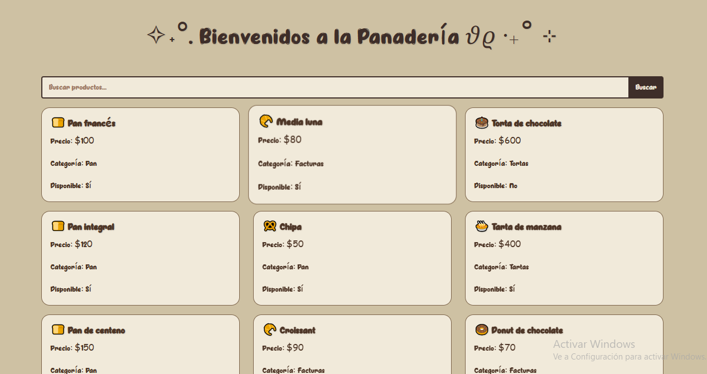

# 🥖 Buscador de Productos para Panadería

Es una página web donde podés buscar y filtrar productos de panadería por nombre o categoría, y ver detalles como el precio y si están disponibles.

## 🛠 Tecnologías usadas
| HTML
| CSS con Bootstrap y algunos estilos propios
| JavaScript 
| Un archivo JSON que tiene los productos

## ✨Qué hace
- Buscador que filtra al instante mientras escribís
- Podés buscar por nombre o categoría
- Diseño simple, lindo y que se adapta al tamaño de la pantalla
- Muestra nombre, precio, categoría y si está disponible
- Usa una fuente personalizada para darle estilo

## 📂 Estructura del proyecto

├── index.html # Página principal

├── styles.css # Estilos personalizados

├── script.js # Lógica de filtrado

├── productos.json # Base de datos de productos

└── fonts/

└── Jellybost.otf # Fuente decorativa

